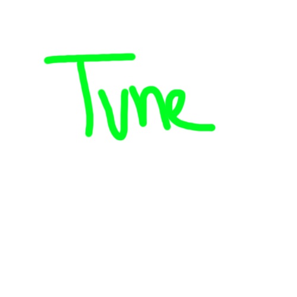

<p align="center">
  <a href="" rel="noopener">
</a>
</p>

<h3 align="center">TuneTrove</h3>

## About 
TuneTrove is a website for rating albums, similar to rateyourmusic.com, but with a twist - users can rate albums without seeing others' ratings, ensuring unbiased feedback. This project serves as a learning experience to explore the advantages and disadvantages of using Supabase and TypeScript in web development.

🔗[Visit Website](https://tunetrove.vercel.app/)

## Built Using

- [T3 Stack](https://create.t3.gg/) - Fullstack
- [TailwindCSS](https://tailwindcss.com/) - CSS framework
- [Supabase](https://supabase.com/) - Supabase

## Try it yourself!
 Create a file in the root directory with the name `.env` containing the filled information of the `.env.example` file.
 
Install packages:
```bash
npm install
```

Running development server:
```bash
npm run dev
```


### Build
To create a production version of your app:
```bash
npm run build
```